# E-Commerce Analytics Pipeline

> **End-to-end data engineering solution**: From raw event ingestion to decision-ready dashboards

[](https://www.python.org/downloads/)
[](https://www.getdbt.com/)
[](https://github.com/psf/black)
[](https://opensource.org/licenses/MIT)

## Overview

This project demonstrates a **production-grade analytics pipeline** for an e-commerce platform, showcasing:

- **Event-driven data ingestion** with schema validation
- **Modular dbt transformations** (staging → intermediate → marts)
- **Data quality testing** at every layer
- **Interactive dashboards** for business stakeholders
- **CI/CD automation** for reliable deployments

## Architecture

```mermaid
%%{init: {'theme': 'dark', 'themeVariables': { 'primaryColor': '#bd93f9', 'primaryTextColor': '#f8f8f2', 'primaryBorderColor': '#6272a4', 'lineColor': '#ff79c6', 'secondaryColor': '#44475a', 'tertiaryColor': '#282a36', 'background': '#282a36', 'mainBkg': '#282a36', 'nodeBorder': '#6272a4', 'clusterBkg': '#44475a', 'clusterBorder': '#6272a4', 'titleColor': '#f8f8f2', 'edgeLabelBackground': '#282a36'}}}%%

flowchart TB
    subgraph Sources [" 🔌 SOURCE SYSTEMS"]
        direction LR
        E["📡 Events<br/><i>JSON / Parquet</i>"]
        P["📦 Product Catalog"]
        U["👤 User Profiles"]
    end

    subgraph Ingestion [" ⚙️ INGESTION LAYER"]
        direction LR
        EX["Extract<br/><i>Pandas</i>"]
        VA["Validate<br/><i>Pydantic</i>"]
        LO["Load<br/><i>Parquet</i>"]
        EX -->|"raw data"| VA -->|"clean data"| LO
    end

    subgraph Storage [" 🗄️ DATA LAKE"]
        direction LR
        RAW["📁 raw/"]
        PROC["📁 processed/"]
        SEED["📁 seeds/"]
    end

    subgraph Transform [" 🔄 TRANSFORMATION — dbt"]
        direction LR
        STG["<b>Staging</b><br/>stg_events<br/>stg_products<br/>stg_users"]
        INT["<b>Intermediate</b><br/>int_sessions<br/>int_user_journey<br/>int_product_perf"]
        MART["<b>Marts</b><br/>fct_daily_engagement<br/>fct_funnel · fct_revenue<br/>dim_users · dim_products · dim_date"]
        STG -->|"clean"| INT -->|"enrich"| MART
    end

    subgraph Warehouse [" 🏛️ DATA WAREHOUSE"]
        DB[("DuckDB <i>(dev)</i><br/>BigQuery · Snowflake <i>(prod)</i>")]
    end

    subgraph Serve [" 📊 PRESENTATION"]
        direction LR
        DASH["🖥️ Streamlit Dashboard<br/><i>KPIs · Funnels · Cohorts</i>"]
        DOCS["📖 dbt Docs & Lineage"]
    end

    subgraph Quality [" 🛡️ QUALITY & CI/CD"]
        direction LR
        TESTS["🧪 pytest · dbt test<br/>Great Expectations"]
        CI["🚀 GitHub Actions<br/><i>Lint → Test → Build → Deploy</i>"]
    end

    E --> EX
    P --> EX
    U --> EX
    LO --> RAW
    LO --> PROC
    SEED -.->|"ref data"| STG
    RAW --> STG
    PROC --> STG
    MART --> DB
    DB --> DASH
    DB --> DOCS
    Quality ~~~ Transform

    style Sources fill:#44475a,stroke:#bd93f9,stroke-width:2px,color:#f8f8f2
    style Ingestion fill:#44475a,stroke:#ffb86c,stroke-width:2px,color:#f8f8f2
    style Storage fill:#44475a,stroke:#50fa7b,stroke-width:2px,color:#f8f8f2
    style Transform fill:#44475a,stroke:#ff79c6,stroke-width:2px,color:#f8f8f2
    style Warehouse fill:#44475a,stroke:#bd93f9,stroke-width:2px,color:#f8f8f2
    style Serve fill:#44475a,stroke:#8be9fd,stroke-width:2px,color:#f8f8f2
    style Quality fill:#44475a,stroke:#f1fa8c,stroke-width:2px,color:#f8f8f2

    style E fill:#282a36,stroke:#bd93f9,color:#f8f8f2
    style P fill:#282a36,stroke:#bd93f9,color:#f8f8f2
    style U fill:#282a36,stroke:#bd93f9,color:#f8f8f2
    style EX fill:#282a36,stroke:#ffb86c,color:#f8f8f2
    style VA fill:#282a36,stroke:#ffb86c,color:#f8f8f2
    style LO fill:#282a36,stroke:#ffb86c,color:#f8f8f2
    style RAW fill:#282a36,stroke:#50fa7b,color:#f8f8f2
    style PROC fill:#282a36,stroke:#50fa7b,color:#f8f8f2
    style SEED fill:#282a36,stroke:#50fa7b,color:#f8f8f2
    style STG fill:#282a36,stroke:#ff79c6,color:#f8f8f2
    style INT fill:#282a36,stroke:#ff79c6,color:#f8f8f2
    style MART fill:#282a36,stroke:#ff79c6,color:#f8f8f2
    style DB fill:#282a36,stroke:#bd93f9,color:#f8f8f2
    style DASH fill:#282a36,stroke:#8be9fd,color:#f8f8f2
    style DOCS fill:#282a36,stroke:#8be9fd,color:#f8f8f2
    style TESTS fill:#282a36,stroke:#f1fa8c,color:#f8f8f2
    style CI fill:#282a36,stroke:#f1fa8c,color:#f8f8f2
```



## Business Context

This pipeline answers critical business questions:

| Question | Metric | Dashboard Section |
|----------|--------|-------------------|
| How are users engaging? | DAU, WAU, MAU | User Engagement |
| What's our conversion funnel? | View → Cart → Purchase rates | Funnel Analysis |
| Which products drive revenue? | Revenue by category, top SKUs | Product Performance |
| When do users convert? | Time-to-purchase, session duration | Behavioral Insights |
| Where do users drop off? | Funnel drop-off rates | Conversion Optimization |

## Project Structure

```
ecommerce-analytics-pipeline/
├── data/
│   ├── raw/                    # Raw event data (JSON/Parquet)
│   ├── processed/              # Cleaned, validated data
│   └── seeds/                  # Reference/lookup data
├── dbt_project/
│   ├── models/
│   │   ├── staging/            # 1:1 source mappings, basic cleaning
│   │   ├── intermediate/       # Business logic, joins, enrichment
│   │   └── marts/              # Analytics-ready facts & dimensions
│   ├── macros/                 # Reusable SQL functions
│   ├── tests/                  # Data quality tests
│   └── seeds/                  # Static lookup tables
├── scripts/
│   ├── generate_events.py      # Synthetic data generator
│   ├── etl_pipeline.py         # Main ETL orchestration
│   ├── data_validation.py      # Schema & quality validation
│   └── utils.py                # Helper functions
├── dashboards/
│   └── streamlit_app.py        # Interactive BI dashboard
├── docs/
│   ├── architecture.md         # Technical architecture
│   ├── data_dictionary.md      # Schema documentation
│   └── runbook.md              # Operations guide
├── tests/                      # Python unit tests
├── .github/workflows/          # CI/CD pipelines
├── pyproject.toml              # Project dependencies
└── README.md
```

## Tech Stack

| Layer | Technology | Purpose |
|-------|------------|---------|
| Data Generation | Python, Faker | Realistic synthetic event data |
| Validation | Pydantic, Great Expectations | Schema enforcement, data quality |
| Storage | DuckDB / PostgreSQL | Local dev / Production |
| Transformation | dbt Core | SQL-based modeling |
| Orchestration | Python / Airflow-ready | Pipeline scheduling |
| Visualization | Streamlit, Plotly | Interactive dashboards |
| Testing | pytest, dbt tests | Code & data quality |
| CI/CD | GitHub Actions | Automated testing & deployment |

## Quick Start

### Prerequisites

- Python 3.10+
- pip or uv package manager

### Installation

```bash
# Clone the repository
git clone https://github.com/yourusername/ecommerce-analytics-pipeline.git
cd ecommerce-analytics-pipeline

# Create virtual environment
python -m venv .venv
source .venv/bin/activate  # On Windows: .venv\Scripts\activate

# Install dependencies
pip install -e .

# Or with uv (faster)
uv pip install -e .
```

### Generate Sample Data

```bash
# Generate 100,000 synthetic events
python scripts/generate_events.py --events 100000 --days 30

# Output: data/raw/events_YYYYMMDD.parquet
```

### Run ETL Pipeline

```bash
# Validate and process raw data
python scripts/etl_pipeline.py

# Output: data/processed/validated_events.parquet
```

### Run dbt Models

```bash
cd dbt_project

# Install dbt dependencies
dbt deps

# Run all models
dbt run

# Run tests
dbt test

# Generate documentation
dbt docs generate
dbt docs serve
```

### Launch Dashboard

```bash
# Start Streamlit dashboard
streamlit run dashboards/streamlit_app.py

# Open http://localhost:8501
```

## Data Models

### Staging Layer (`stg_*`)
Raw data cleaning and standardization:
- `stg_events` - Base event facts
- `stg_users` - User attributes
- `stg_products` - Product catalog

### Intermediate Layer (`int_*`)
Business logic and enrichment:
- `int_sessions` - Sessionized user activity
- `int_user_journey` - User funnel progression
- `int_product_interactions` - Aggregated product events

### Marts Layer (`fct_*`, `dim_*`)
Analytics-ready tables:
- `fct_daily_engagement` - Daily user metrics
- `fct_conversions` - Purchase funnel facts
- `fct_revenue` - Revenue aggregations
- `dim_users` - User dimension (SCD Type 2)
- `dim_products` - Product dimension
- `dim_date` - Date dimension

## Key Features

### 1. Robust Data Validation
```python
# Pydantic models ensure schema compliance
class EventSchema(BaseModel):
    event_id: str
    user_id: str
    event_type: Literal["page_view", "add_to_cart", "purchase"]
    timestamp: datetime
    properties: dict
```

### 2. Modular dbt Transformations
```sql
-- marts/fct_daily_engagement.sql
SELECT
    date_trunc('day', event_timestamp) AS activity_date,
    COUNT(DISTINCT user_id) AS daily_active_users,
    COUNT(DISTINCT session_id) AS total_sessions,
    SUM(CASE WHEN event_type = 'purchase' THEN 1 ELSE 0 END) AS purchases
FROM {{ ref('int_sessions') }}
GROUP BY 1
```

### 3. Comprehensive Testing
- **Schema tests**: not_null, unique, accepted_values
- **Relationship tests**: Foreign key integrity
- **Custom tests**: Business rule validation
- **Python tests**: ETL logic verification

### 4. Production-Ready Documentation
- Auto-generated dbt docs with lineage
- Data dictionary with business definitions
- Runbook for operations

## Performance Metrics

| Metric | Value |
|--------|-------|
| Events processed | 250,000+ rows |
| Pipeline runtime | ~45 seconds (local) |
| Model count | 12 dbt models |
| Test coverage | 95%+ |
| Dashboard load time | <2 seconds |

## Sample Dashboard

The Streamlit dashboard provides:

- **Executive Summary**: KPIs at a glance
- **User Engagement**: DAU/WAU/MAU trends
- **Funnel Analysis**: Conversion rates by step
- **Product Performance**: Revenue by category
- **Cohort Analysis**: Retention over time

## Extending the Pipeline

### Adding New Event Types
1. Update `EventSchema` in `scripts/data_validation.py`
2. Add staging model in `dbt_project/models/staging/`
3. Update downstream models as needed
4. Add tests in `dbt_project/tests/`

### Connecting to Cloud
The pipeline is designed for easy cloud migration:
- **GCP**: BigQuery + Cloud Storage + Dataflow
- **AWS**: Redshift + S3 + Glue
- **Azure**: Synapse + Blob Storage + Data Factory

## Contributing

1. Fork the repository
2. Create a feature branch (`git checkout -b feature/amazing-feature`)
3. Commit changes (`git commit -m 'Add amazing feature'`)
4. Push to branch (`git push origin feature/amazing-feature`)
5. Open a Pull Request

## License

This project is licensed under the MIT License - see the [LICENSE](LICENSE) file.

## Author

**Dinesh Palli**
Data Engineer | Analytics Engineer
[GitHub](https://github.com/dineshpalli) | [LinkedIn](https://linkedin.com/in/dineshpalli)

---

*Built with a focus on clean code, reproducibility, and business impact.*
